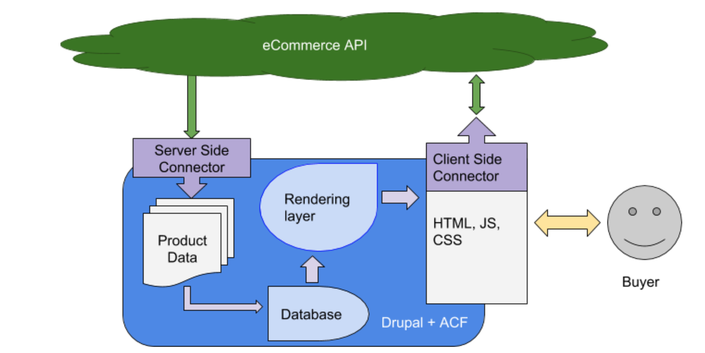

# Overview
Every ecommerce implementation is unique in some way. Product data models, custom business logic, custom integration systems, branding guidelines, user experience requirements, etc.

Drupal provides a number of different integration methodologies that make it much easier to build amazing experiences. However, it can be difficult to know which approaches to use in specific situations.

ACF is intended to be a collection of modules, documentation, and reference architecture examples that allow you to explore different strategies designed to support contextual commerce.

## Two part integration strategy

**1. Server side integration - cacheable data**
Any cacheable data from the ecommerce engine should be considered for periodic import into the CMS. This allows the side builders and content creators to easily use the data in their creation of content - this is *contextual commerce*.

**2. Client side integration - transactional data**
Any data or interactions that are specific to the user should be handled with Javascript in the client. Things like the cart and checkout process require direct access to the ecommerce API.

## Primary guidelines
* **Make it easy for the content creator.**
For the content creator, their ability to easily use product data in their content means that they will be more likely to do so. This contextual commerce helps increase sales.

* **Make it easy for the front end developer.**
There is a broader availability of good Javascript developers that can help drive the transactional integration. For these developers, their workflow is largely unchanged. They can build out Javascript components using their favorite framework, and then just add a simple Yaml file to make it available as a block in Drupal. No muss, no fuss.

* **Make good use of Drupal's framework.**
As much as possible, we want to not only follow best practices, but also utilize the core functionality that Drupal provides. Back end developers should find this all very straightforward, and site builders will apperciate how easy it is to build their experience with content, taxonomy, views, blocks, etc.

* **Make it scalable.**
The best way to scale is to leverage the caching abilities in Drupal for building the page. Then, we use decoupled JS components running on the page to manage communications with the ecommerce engine. Drupal is optimized for site and content building, and the components provide a modern experience.